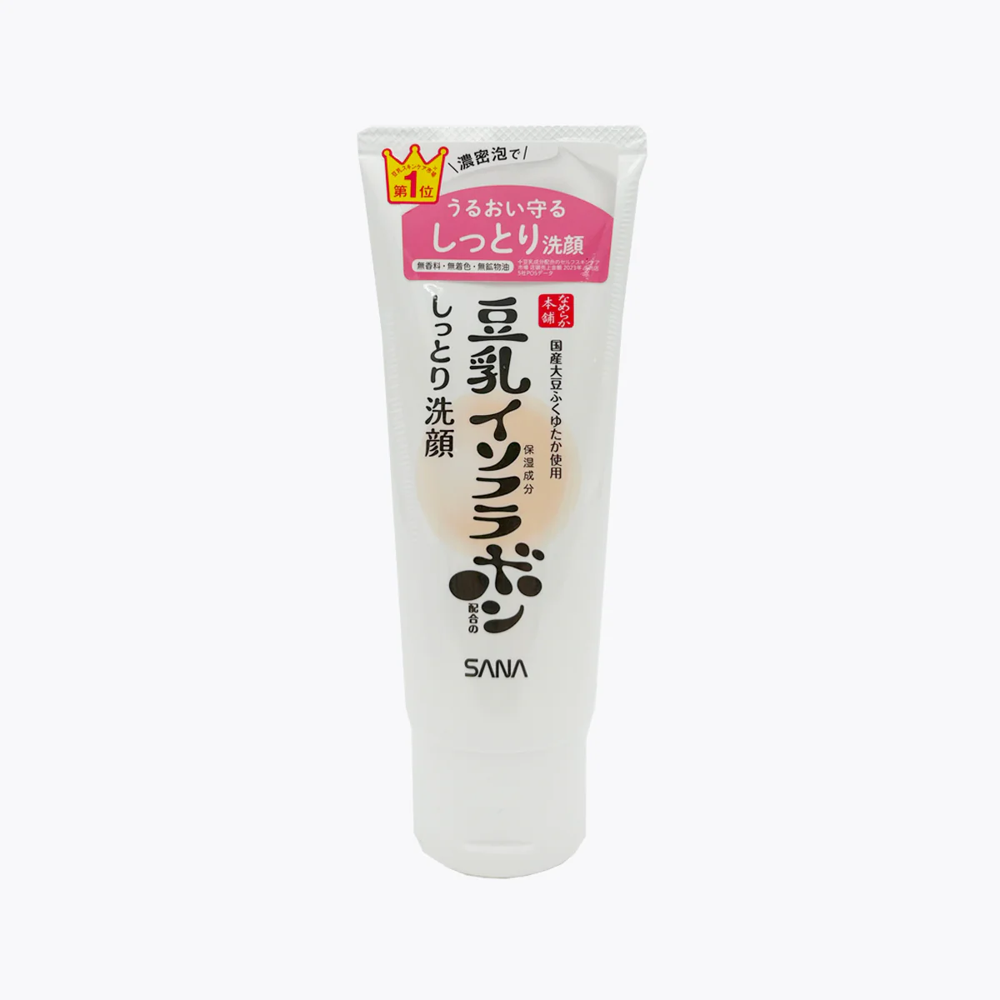
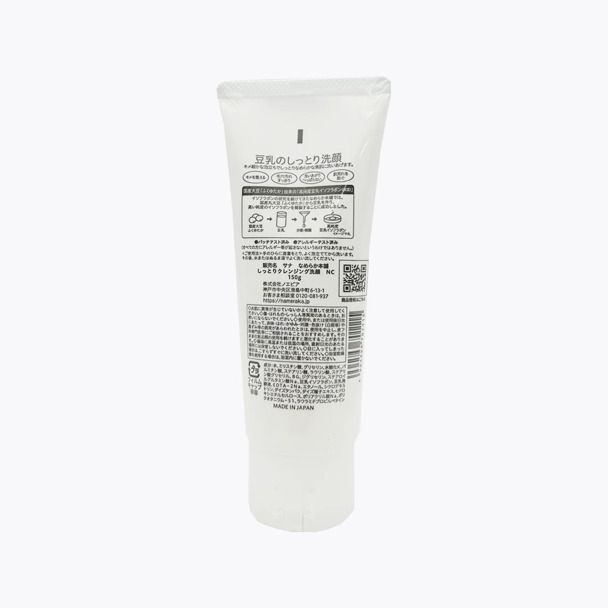

# 🧴 SANA豆乳洗面奶（Namerakahonpo Cleansing Wash NA）

  
  

---

<strong>中文 | Chinese</strong>

<strong>基础信息</strong>（点击展开）

| 品牌   | 产地     | 规格  |
| ------ | -------- | ----- |
| SANA（莎娜） | 日本、中国 | 150g  |

## ✨ 产品简介
> SANA豆乳洗面奶是日本超人气的温和洁面产品，主打豆乳发酵液保湿成分，泡沫绵密丰富。

## 🧾 洁面类型
皂基为主、复配甜菜碱表活

## 🧾 主要成分
豆乳发酵液（水解大豆蛋白）、甘油、植物性清洁成分
无香料、无色素、无矿物油

## 📝 使用方法
1. 取适量（约1cm）于掌心，加水揉搓起泡。
2. 将泡沫均匀涂抹于湿润的面部，轻柔打圈按摩。
3. 用清水彻底冲洗干净。

## 🧑‍💻 使用体验
> - 皂基洗面奶，清洁力不用担心，但要注意可能的清洁力过强
> - 适合混合与油性皮肤，不适合干皮 (虽然我这个超级大沙漠用起来感觉还挺好的，大概是保湿做的好)
> - 使用后容易出现皮肤干燥，要注意做好保湿
> - 瓶盖设计缺陷，导致很容易把使用后残留在瓶口的洗面奶流出来
> - 有足够的耐心的话，建议搭配起泡网使用，打出来的泡沫真的很细腻
> - 添加物基本是噱头，没太大实际效果

<strong>English</strong>

<strong>Basic Info</strong> (click to expand)

| Brand | Origin      | Net Weight |
| ----- | ----------- | ---------- |
| SANA  | Japan/China | 150g       |

## ✨ Product Introduction
> SANA Soy Milk Cleansing Wash is a super popular gentle cleanser from Japan, featuring soy milk ferment extract for hydration and a dense, rich foam.

## 🧾 Cleanser Type
Mainly soap-based, with added betaine surfactant

## 🧾 Key Ingredients
Soy milk ferment extract (hydrolyzed soy protein), glycerin, plant-based cleansing agents
No fragrance, no colorants, no mineral oil

## 📝 How to Use
1. Squeeze about 1cm onto your palm, add water and lather up.
2. Apply the foam evenly to your wet face and gently massage in circles.
3. Rinse thoroughly with water.

## 🧑‍💻 User Experience
> - Soap-based cleanser, so cleansing power is strong—be aware it may be too much for some
> - Best for combination and oily skin, not suitable for dry skin (though my super dry skin actually feels fine, probably because I moisturize well)
> - May cause dryness after use, so be sure to moisturize well
> - The cap design is flawed, so leftover cleanser tends to leak from the opening
> - If you have patience, use a foaming net—the foam you get is super fine and dense!
> - Added ingredients are mostly for marketing, don't expect much real effect

